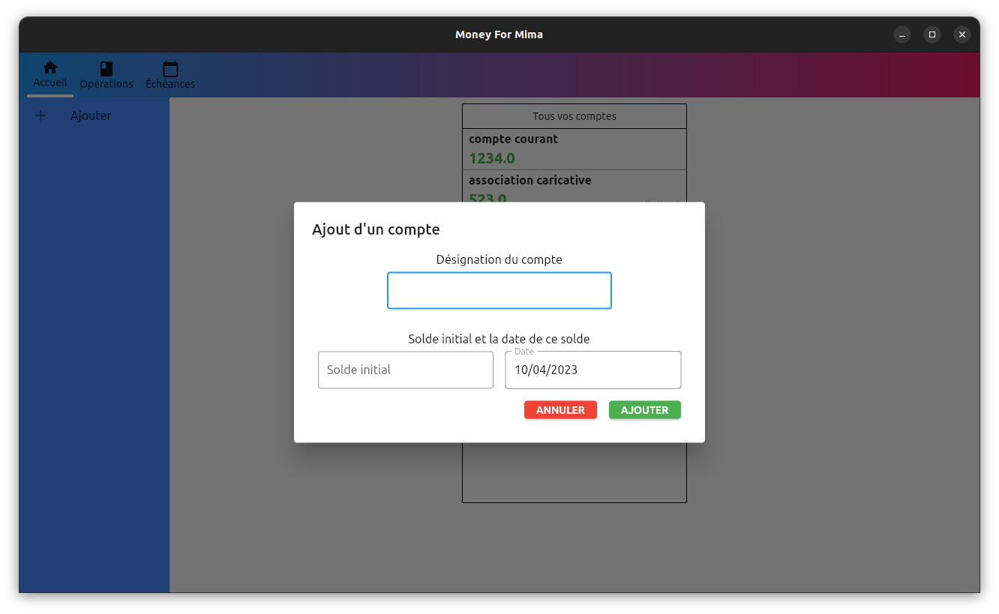
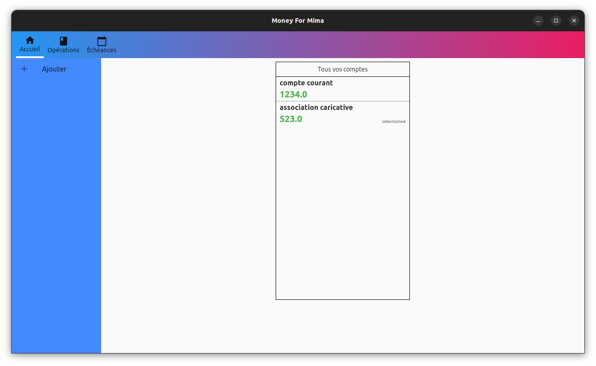
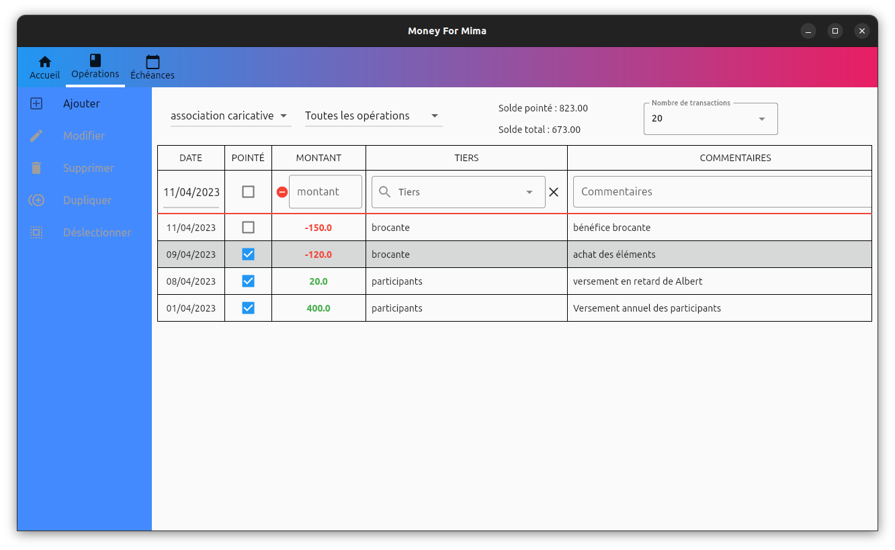
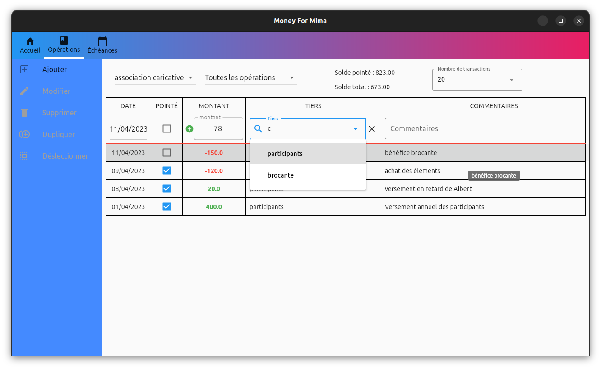
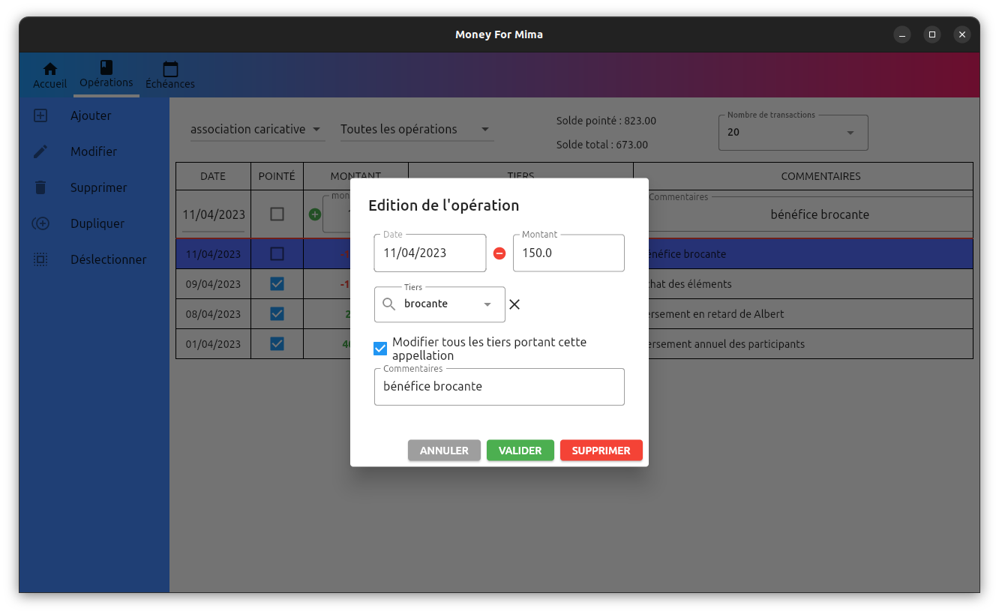
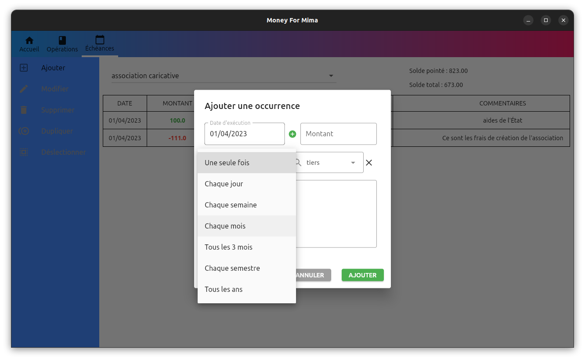
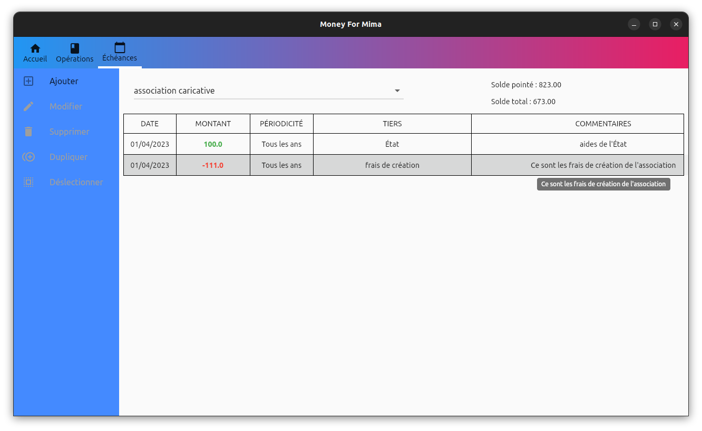

# Money For Mima

Une application desktop destinée à la gestion de votre compte bancaire en local

Cette application est arrivée à une version beta, cependant elle peut être utilisée mais des bugs peuvent survenir.

Vous pouvez dès maintenant télécharger la verion beta, via les fichiers zip disponibles, les programmes d'installation sont présents dedans.

# Installation

Téléchargez le fichier ZIP contenant tous les fichiers nécéssaires à l'installation du Money For Mima. Puis extrayez le fichier dans un dossier.

## Linux

Exécutez ensuite le fichier "install" en faisant un clic droit > exécuter comme un programme.
OU
Ouvrez un terminal dans le dossier contenant le fichier puis exécuez la commande suivant : "./install"

Ensuite suivez les indications pour répondre aux questions.

## Windows

Effectuez un double clic sur le fichier install.exe

Un interface de ligne de commande sera ouverte, suivez ensuite les instructions.

## Macos

Non disponible pour le moment

# Utilisation

## Pages d'accueil
Interface recenseant tous vos comptes, avec lesquels vous pouvez interargir, pour le moment les favoris n'ont pas d'intérêts. Lors de cette page, des informations vous seront fournies si jamais des occurences ont eu lieu.

Créez un compte facilement

Ayez un vision de tous vos compte dès la page d'accueil

Gérez vos comptes

## Page des opérations
Interfaces vous permettant d'ajouter, de gérer ou encore de supprimer vos opérations. Le solde du compte est ainsi mis à jour en fonction des opérations pointées. Vous pouvez également sélectionner un compte, trier les éléments par opérations pointées mais aussi par date, sans oublier la sélection du nombre d'opérations à afficher.

Toutes vos opérations

Ajout d'opérations
Pour ajouter une opération, il vous suffit de remplir la première ligne et d'ensuite cliquer sur le bouton "AJOUTER", les commentaires ne sont pas obligatoires.

Sélection d'opérations
Vous pouvez ensuite les dupliquer, les supprimer ou bien les désélectionner

Modification ou suppression des opérations

## Page des échéances

Toutes vos échéances

Ajout d'échéances
Pour ajouter des échéances, il vous faudra cliquer sur le bouton "AJOUTER", ensuite plusieurs options seront possibles : 

Les occurrences uniques, qui ne seront exécutées seulement à la date donnée, une particularité: doivent être après la date d'aujoud'hui

Les occurrences périodiques.

Lors de l'activation d'un occurrence, l'ajout de l'opération liée vous sera indiquée au niveau de la page d'accueil.

